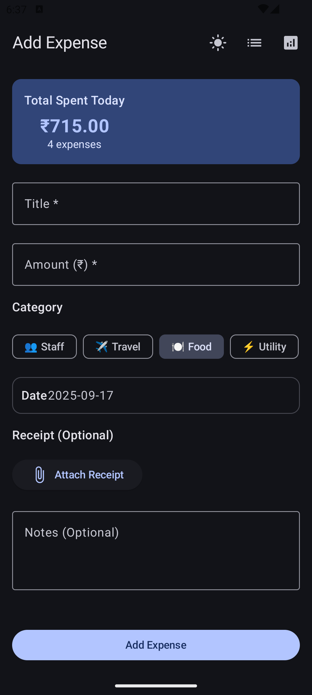
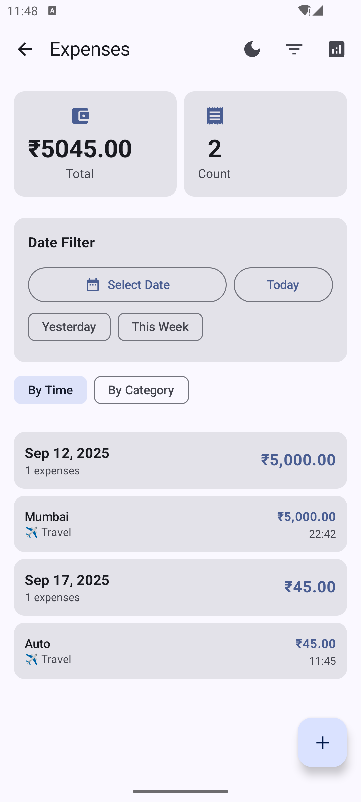
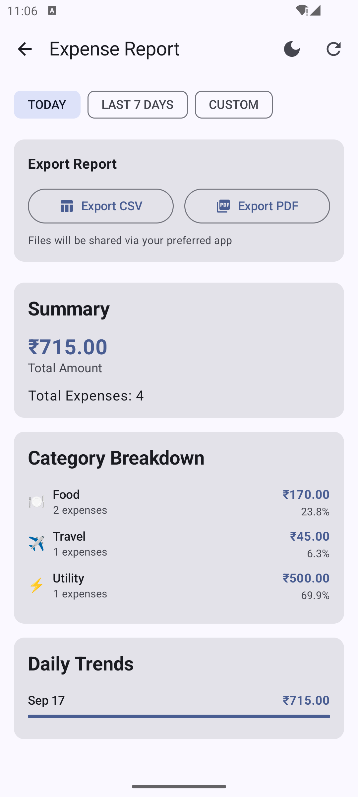
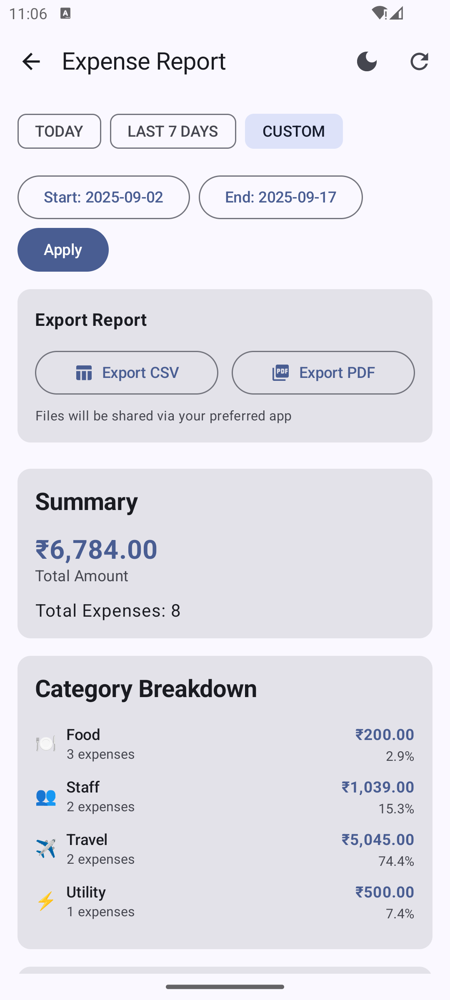

# Smart Daily Expense Tracker

## App Overview
A modern Android expense tracking application built with Jetpack Compose, MVVM architecture, and Clean Architecture principles. The app allows users to record daily expenses, categorize spending, view detailed reports with analytics, and export data in multiple formats. Features include receipt image attachments, date-based filtering, dark/light theme support, and comprehensive expense analytics.

## AI Usage Summary
This project was developed using AI assistance throughout the entire development lifecycle. Cursor was used for architectural planning, code generation, debugging, and feature implementation. The AI helped design the Clean Architecture structure, implement MVVM patterns with StateFlow, create Room database entities, build Jetpack Compose UI components, and resolve complex Android-specific issues like FileProvider implementation. AI was particularly valuable for generating boilerplate code, implementing complex UI animations, and debugging compilation errors across multiple modules.

## Prompt Logs

### Initial Project Setup
```
"Please read this document carefully and before you start coding first understand all the requirements(functional + Non functional). We'll be using MVVM + Clean Architecture + Compose + Hilt - First make a to do list for all the task"
```

### Architecture Implementation
```
"Yes. Now start with setting up the project architecture by including all the necessary dependencies and following the list you mentioned."
```

### Feature Development
```
"Please give option to add image and animation on expense entry -Optional Receipt Image (upload or mock) -Submit Button: Adds expense, shows Toast, animates entry - Option of time(calender) to enter expense on back date as well - In Reports summary, give calender(date) as filter option"
```

### UI/UX Improvements
```
"For Reports screen - in place of last 30 days show calender and then filter according to that date. Listing screen - When selecting by category same expense is showing twice."
```

### Export Feature Implementation
```
"For expense report screen, implement these - Export( Simulate PDF/CSV export) - Trigger Share intent"
```

### Bug Fixes
```
"I'm getting multiple error when building the application. Please fix it"
```

### Date Validation
```
"In Expense Entry screen, add a check which doesn't let enter expense after today's date"
```

### Error Resolution
```
"Getting error when click on export pdf/export csv. please check and fix"
```

## Checklist of Features Implemented

### 📱 Required Screens & Flows

#### Expense Entry Screen
- [x] **Title (text)** - Text input field for expense title
- [x] **Amount (₹)** - Numeric input field for expense amount
- [x] **Category** - Dropdown with categories (Food, Travel, Utility, Entertainment, Shopping, Healthcare, Education, Other)
- [x] **Optional Notes (max 100 chars)** - Text input with character limit
- [x] **Optional Receipt Image (upload)** - Image picker with gallery integration
- [x] **Submit Button** - Adds expense, shows Toast, animates entry
- [x] **Real-time 'Total Spent Today'** - Live calculation displayed at top

#### Expense List Screen
- [x] **View expenses for: Today (default)** - Default view shows today's expenses only
- [x] **Previous dates via calendar/filter** - Date picker with proper date selection handling
- [x] **Quick date options** - "Today", "Yesterday", "This Week" buttons for instant access
- [x] **Group by category or time (toggle)** - Switch between grouping options
- [x] **Total count, total amount** - Summary statistics displayed for filtered period
- [x] **Empty state** - Proper handling when no expenses exist
- [x] **Date filter section** - Prominent date filter with current date display and status

#### Expense Report Screen
- [x] **Mock report for last 7 days** - Default 7-day report view
- [x] **Daily totals** - Day-by-day expense breakdown
- [x] **Category-wise totals** - Spending by category with percentages
- [x] **Bar chart (mocked)** - Visual representation using LinearProgressIndicator
- [x] **Simulate PDF/CSV export** - Export functionality implemented
- [x] **Trigger Share intent** - Native Android sharing integration

### 🏗️ State Management & Data Layer
- [x] **ViewModel + StateFlow** - Reactive state management implemented
- [x] **Room database** - Local persistence with SQLite
- [x] **Screen transitions via Navigation** - Navigation Compose integration
- [x] **Repository pattern** - Clean Architecture data layer
- [x] **Use cases** - Business logic separation

### 🎯 Bonus Challenges
- [x] **Theme switcher (Light/Dark)** - Complete theme toggle functionality
- [x] **Persist data locally (Room)** - Full Room database implementation
- [x] **Animation on add** - Smooth animations for expense entry
- [x] **Duplicate detection** - Prevents duplicate expense entries
- [x] **Validation (amount > 0, title non-empty)** - Comprehensive form validation
- [x] **Reusable UI components** - Modular component architecture

### 🔄 Additional Features Implemented
- [x] **Date picker for expense entry** - Backdate expenses (no future dates)
- [x] **Custom date range filtering** - Flexible report periods
- [x] **Receipt image preview** - Thumbnail display with Coil
- [x] **FileProvider integration** - Secure file sharing
- [x] **Error handling** - Comprehensive error states and recovery
- [x] **Loading states** - User feedback during operations
- [x] **Toast notifications** - Success/error messaging
- [x] **Clean Architecture** - MVVM + Clean Architecture implementation
- [x] **Hilt dependency injection** - Modern DI framework
- [x] **Jetpack Compose** - Modern declarative UI framework

### ❌ Not Implemented
- [ ] **Offline-first sync (mock)** - Not required for current scope
- [ ] **Advanced chart visualizations** - Using simple progress bars instead
- [ ] **Unit tests** - Pending implementation

## Technical Stack
- **Language**: Kotlin
- **UI Framework**: Jetpack Compose
- **Architecture**: MVVM + Clean Architecture
- **Dependency Injection**: Hilt
- **Database**: Room (SQLite)
- **Navigation**: Navigation Compose
- **Image Loading**: Coil
- **Async Operations**: Kotlin Coroutines
- **State Management**: StateFlow
- **Build System**: Gradle with Kotlin DSL

## Screenshots

### Expense Entry Screen
| Light Theme | Dark Theme | Success State |
|-------------|------------|---------------|
|  |  |  |

### Expense List Screen
| Default View (Today) | Date Filter | Filter Results |
|---------------------|-------------|----------------|
|  |  |  |

### Expense Report Screen
| Today's Report | 7-Day Report | Custom Date Range |
|----------------|--------------|-------------------|
|  |  |  |

### Export & Sharing
| Full Report View | Share Intent |
|------------------|--------------|
|  |  |

## Download APK

### Debug Build
Download the latest debug APK to test the application:

**[📱 Download Debug APK](app/debug/app-debug.apk)**

> **Note**: This is a debug build for testing purposes. Enable "Install from Unknown Sources" in your Android device settings to install the APK.

## Getting Started

### Option 1: Install APK
1. Download the debug APK from the link above
2. Enable "Install from Unknown Sources" in Android settings
3. Install the APK on your device
4. Start tracking your expenses!

### Option 2: Build from Source
1. Clone the repository
2. Open in Android Studio
3. Sync Gradle files
4. Run on device or emulator
5. Start tracking your expenses!

## License
This project is for educational purposes and demonstrates modern Android development practices.
